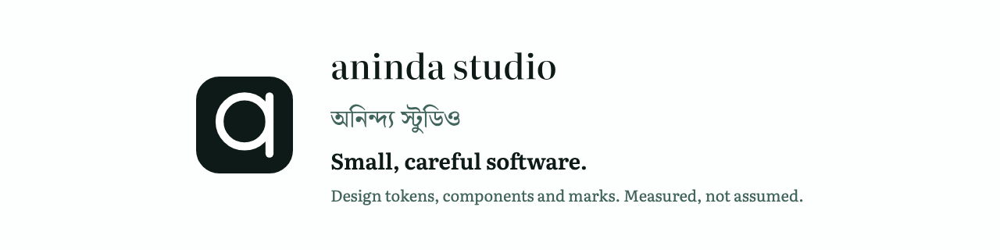

<!-- GENERATED by scripts/readme.py — do not hand-edit. -->

<p align="center">
  <picture>
    <source media="(prefers-color-scheme: dark)" srcset="10_assets/README-header-dark.png">
    
  </picture>
</p>

# অনিন্দ্য স্টুডিও

**এক জনের গড়া একটি ব্র্যান্ড ও ডিজাইন পদ্ধতি — যেখানে প্রতিটি দাবি মেপে দেখা
হয়েছে, শুধু বলা হয়নি।**

*Aninda Studio · [Read in English](README.md)*

আমি ছোটো, যত্নে গড়া সফটওয়্যার বানাই। কোনো কিছুর সীমা থাকলে সেটা এখানেই লেখা
থাকবে — লুকিয়ে রাখা হবে না।

## মূল কথাটা

**এখানের প্রতিটি রঙের জোড়া মেপে নেওয়া, বেছে নেওয়া নয়।**

4টি থিমে মোট **44টি জোড়া** আছে — আলো, অন্ধকার, আর বেশি
কনট্রাস্টের দুটি। প্রতিটি জোড়া যে যে পৃষ্ঠের উপর বসতে পারে, সবগুলোর সঙ্গে মেপে
দেখা হয়েছে। মাপা হয়েছে সেই ৮-বিট হেক্স মানে, ব্রাউজার আসলে যেটা দেখায় — তারপর
দুই রঙের প্রতিটি চ্যানেল এক বিট সরিয়ে আবার মাপা হয়েছে। যেটা প্রকাশ করা হয়েছে,
সেটা এই সবের মধ্যে সবচেয়ে খারাপ ফলাফল।

- **লেখার জন্য 28টি জোড়া।** সবচেয়ে কম **5.3348:1** —
  সাধারণ থিমে সীমা ৪.৫:১, বেশি কনট্রাস্টে ৭:১।
- **লেখা ছাড়া 12টি জোড়া** — সীমারেখা আর ফোকাস রিং। সবচেয়ে কম
  **3.8134:1** — সীমা ৩:১।

দুটি আলাদা করে গোনা হয়েছে, কারণ **লেখা ছাড়া কনট্রাস্টের জন্য WCAG-এ AAA স্তর
নেই**। তাই ৩.৯:১ মানের একটি সীমারেখা তার নিয়ম পুরোপুরি মেনেছে; ৪.৫:১ দিয়ে বিচার
করলে উত্তীর্ণকে ব্যর্থ বলা হবে।

তাই এখানে হাতে লেখা কোনো কনট্রাস্টের সংখ্যা নেই। মানুষের হাতে লেখা সংখ্যা ভুল
হতে পারে, আর ভুল থেকেই যেতে পারে।

## এখানে কী আছে

| ফোল্ডার | কী আছে |
|---|---|
| `09_guidebook/` | **নির্দেশিকা।** বাংলা ও ইংরেজিতে 14টি অধ্যায়, একটি ফাইলেই (15.2 মেগাবাইট), ইন্টারনেট ছাড়াই চলে। সঙ্গে 1.9 মেগাবাইটের PDF |
| `07_tokens/` | ডিজাইন টোকেন — DTCG সূত্র, আর তা থেকে বানানো 64টি CSS প্রপার্টি |
| `08_components/` | 30টি উপাদান ও নকশার কার্ড |
| `04_mark/` | চিহ্ন, নামলিপি আর আইকনের 10টি ফাইল |
| `10_assets/` | নানা মাপে তৈরি 20টি ছবি |
| `11_site/` | ওয়েবসাইট, টোকেন থেকে বানানো |
| `12_packages/` | টোকেনগুলো npm ও Python প্যাকেজ হিসেবে |
| `13_plugins/` | Figma প্লাগইন, Claude Code প্লাগইন আর Claude Design বান্ডিল |

## শুরু করতে

> **Not published yet.** *This paragraph is in English because no reviewed Bangla
> exists for it, and the rule in this project is to leave the English rather than
> invent the Bangla.* On 2026-08-18 I checked the npm registry and the Python Package Index, and
> neither holds `aninda-studio-tokens`. So `npm install` and `pip install` will not work yet.
> The command below works from a local checkout.

```bash
./.venv/bin/python 00_sandbox/measure.py
```

এই কমান্ডটি সত্যিকারের একটি ব্রাউজার খুলে প্রতিটি রঙের জোড়া আবার মেপে
দেখে। কয়েক সেকেন্ড লাগে। হয় সে টোকেন ফাইলের সঙ্গে একমত হবে, নয়তো ঠিক কোথায় মেলে না
তা বলে দেবে।

## যা এই পদ্ধতি করে না

- **কোনো স্ক্রিন রিডার ব্যবহারকারী এটি পরীক্ষা করেননি।** কনট্রাস্ট মাপা হয়েছে ও
  প্রমাণ করা হয়েছে। কিন্তু বাস্তবে ব্যবহারের সুবিধা আলাদা দাবি, আর সেই দাবি এখানে
  করা হয়নি।
- **কোনো ব্যবহারকারী গবেষণা হয়নি।** এক জনের বিচার, এবং সেটা স্পষ্ট করেই বলা।
- **দ্বিতীয় কোনো বাংলা পাঠক এই বাংলা দেখেননি।** বানান বাংলা একাডেমির প্রমিত
  নিয়ম মেনে, প্রতিটি সিদ্ধান্তের সূত্র দেওয়া — তবু সূত্র থাকা আর ভালো পড়া এক
  জিনিস নয়।
- **পরীক্ষা শুধু Chromium-এ।** নিজের ম্যাকে আর CI-তে উবুন্টুতে, দুই জায়গাতেই চলে —
  তাই ফলাফল কোনো একটি যন্ত্রের উপর নির্ভর করে না। Safari, Firefox আর উইন্ডোজের হাই
  কনট্রাস্ট পরীক্ষা করা হয়নি।
- **সব জায়গায় আইকনের কোণ গোল, Apple-সহ।** এটি Apple-এর বর্তমান নির্দেশনার
  বিপরীতে নেওয়া একটি সিদ্ধান্ত। এর বিনিময়ে কী ছাড়া হলো, তা
  `04_mark/manifest.json`-এ লেখা আছে।
- **ওয়েবসাইটটি এখনো প্রকাশ করা হয়নি, ডোমেইনটিও নিবন্ধন করা হয়নি।** `11_site/`
  ফোল্ডারে `anindastudio.com` লেখা আছে, কারণ সাইটটি ওই ঠিকানার জন্যই তৈরি।
  ১৯ অগস্ট ২০২৬ পর্যন্ত `.com` নিবন্ধকের কাছে ওই নামের কোনো রেকর্ড নেই, তাই
  ওখানে এখনো কিছুই দেখা যাবে না।

## লাইসেন্স

চারটি আলাদা লাইসেন্স, কারণ অংশগুলো সত্যিই আলাদা। বিস্তারিত `NOTICE` ফাইলে।

- **পদ্ধতি** — টোকেন, স্টাইলশিট, উপাদান, স্ক্রিপ্ট: **Apache-2.0**। বাণিজ্যিক
  কাজেও ব্যবহার করা যায়।
- **লেখা** — নির্দেশিকা ও নথিপত্র: **PolyForm Noncommercial 1.0.0**। পড়া, নকল
  করা, বদলানো যায়; বিক্রি করা যায় না। এটি উৎস-উন্মুক্ত, **ওপেন সোর্স নয়**।
- **হরফ** — Literata, Noto Serif Bengali, IBM Plex Mono: **SIL OFL 1.1**।
- **নাম ও চিহ্ন** — **কোনো লাইসেন্স নেই**। পদ্ধতি নিন, পরিচয়টি রেখে দিন।

প্রশ্ন বা অনুমতির জন্য: **aninda.sh15@gmail.com**

*এটি আইনি পরামর্শ নয় — লেখক আইনজীবী নন।*
